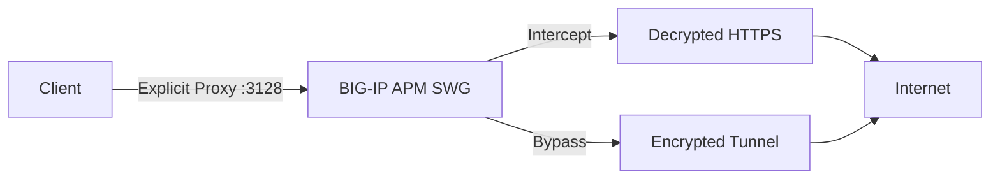
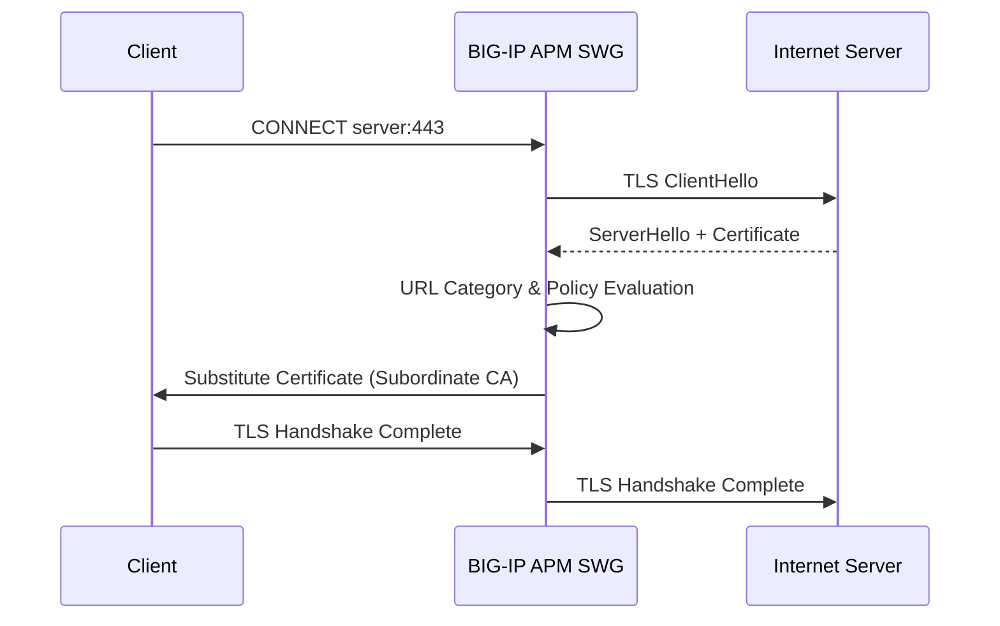
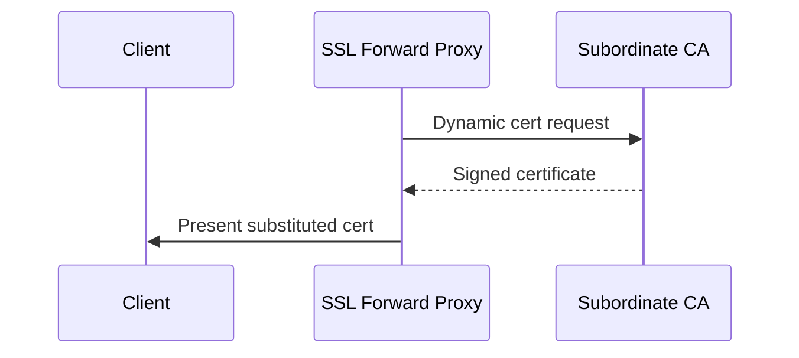
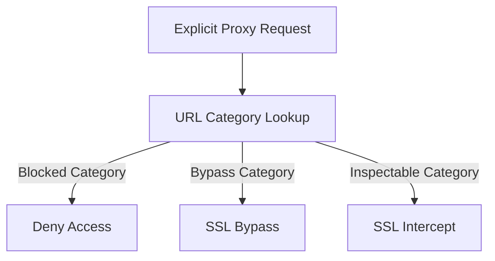

# BIG-IP APM Secure Web Gateway (SWG)
## Explicit Forward Proxy – SSL Intercept and Bypass Deployment

This repository provides a full reference implementation for **BIG-IP APM Secure Web Gateway (SWG)** operating as an **Explicit Forward Proxy** with support for **SSL Intercept** and **SSL Bypass**, aligned with F5 BIG-IP 16.1 documentation.

---

## Architecture Overview



---

## TLS Handshake – SSL Intercept



---

## Certificate Substitution



---

## APM Policy Decision Tree



---

## BIG-IP Configuration Screenshots (Placeholders)

> Replace the following images with screenshots from your BIG-IP system.

- **Explicit Proxy Listener**
  - `images/explicit-proxy-listener.png`

- **SSL Forward Proxy Profile**
  - `images/ssl-forward-proxy-profile.png`

- **APM Access Policy**
  - `images/apm-access-policy.png`

- **URL Filtering Policy**
  - `images/url-filtering-policy.png`

---

## curl Test Scripts

Scripts are located under `tests/`.

### Intercept Test
```bash
curl -x http://<BIGIP_IP>:3128 https://www.example.com -v
```

### Bypass Test
```bash
curl -x http://<BIGIP_IP>:3128 https://bank.example.com -v
```

### Blocked Category Test
```bash
curl -x http://<BIGIP_IP>:3128 https://www.youtube.com -v
```

---

## Repository Structure

```
.
├── README.md
├── certs/
├── configs/
├── logs/
├── tests/
└── images/
```

---

## Disclaimer

This repository is provided for reference and educational purposes. Review all configurations before production deployment.
# bigip-apm-swg-intercept-bypass-explicity-proxy
