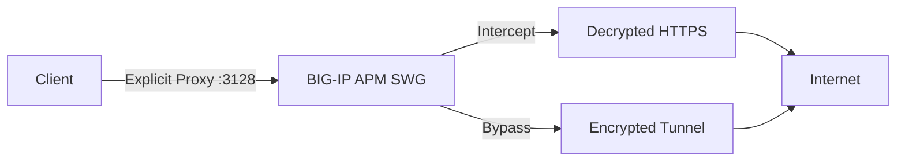
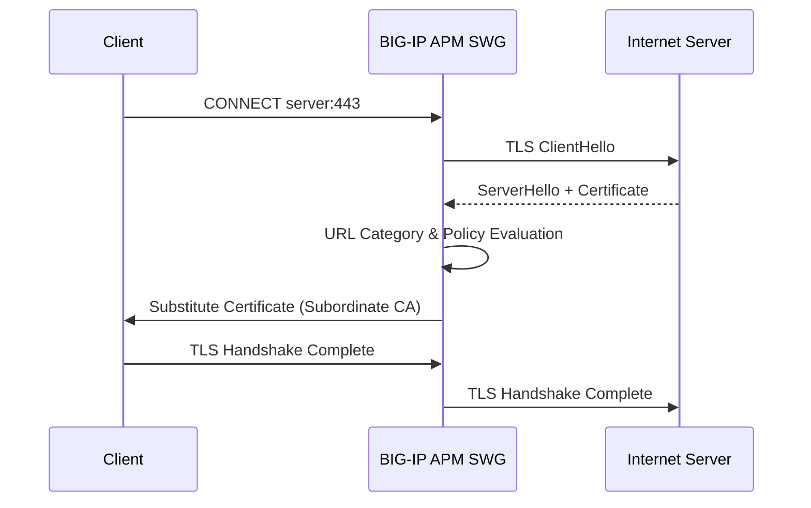
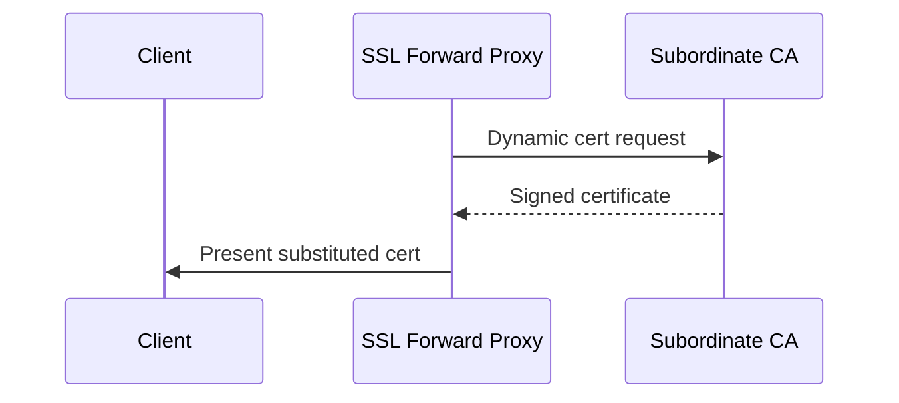
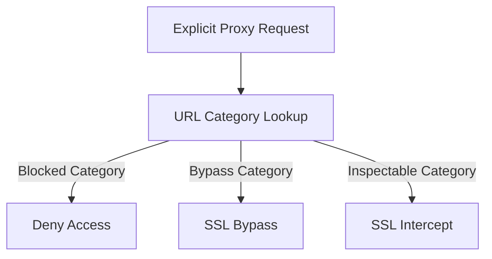

# BIG-IP APM Secure Web Gateway (SWG)
## Explicit Forward Proxy – SSL Intercept and Bypass Deployment

This repository provides a full reference implementation for **BIG-IP APM Secure Web Gateway (SWG)** operating as an **Explicit Forward Proxy** with support for **SSL Intercept** and **SSL Bypass**, aligned with F5 BIG-IP 16.1 documentation.

---

## Architecture Overview



---

## TLS Handshake – SSL Intercept



---

## Certificate Substitution



---

## APM Policy Decision Tree



---

## BIG-IP Configuration Screenshots (Placeholders)

- **APM-Explicit forward Bypass proxy-with-the-subordinate-CA**
(images/apm-Explicit forward Bypass proxy-with-the-subordinate-CA.png)

- **APM-Explicit forward Bypass proxy-with the subordinate-CA-Categort-Lookup_URL Filtering_Assign**
(images/apm-Explicit forward Bypass proxy-with the subordinate-CA-Categort-Lookup_URL Filtering_Assign.png)

- **APM-Explicit forward Bypass proxy-with-the-subordinate-CA**
(images/apm-Explicit forward Bypass proxy-with-the-subordinate-CA.png)

- **APM-Explicit forward Intercept proxy-with the subordinate-CA-Categort-Lookup_URL Filtering_Assign**
(images/apm-Explicit forward Intercept proxy-with the subordinate-CA-Categort-Lookup_URL Filtering_Assign.png)

---

## curl Test Scripts

Scripts are located under `tests/`.

### Intercept Test
```bash
curl -x http://<BIGIP_IP>:3128 https://www.example.com -v
```

### Bypass Test
```bash
curl -x http://<BIGIP_IP>:3128 https://bank.example.com -v
```

### Blocked Category Test
```bash
curl -x http://<BIGIP_IP>:3128 https://www.youtube.com -v
```

---

## Repository Structure

```
.
├── README.md
├── certs/
├── configs/
├── logs/
├── tests/
└── images/
```

---


## Version Information

- **BIG-IP Version Tested:** 17.5.1.3
- **Purpose:** BIG-IP Access Policy Manager (APM) implements a Secure Web Gateway (SWG) for outbound access by providing access control based on URL categorization to forward proxy. With APM, you can create a configuration to protect your network assets and end users from threats, and enforce a use and compliance policy for Internet access. Users that access the Internet from the enterprise go through APM, which can allow or block access to URL categories or indicate that the user should confirm the URL before access can be allowed.

---

## License

This project is intended for operational automation within F5 environments.  
Use at your own risk and validate in a test environment prior to production deployment.


## 🧾 References & Resources

- [F5 SWG Overview](https://techdocs.f5.com/en-us/bigip-16-1-0/big-ip-access-policy-manager-secure-web-gateway/big-ip-apm-secure-web-gateway-overview.html)  
- [F5 SWG APM Implementation Overview](https://techdocs.f5.com/kb/en-us/products/big-ip_apm/manuals/product/apm-secure-web-gateway-implementations-11-5-0.html)
---

## ⚙️ Notes

- Requires F5 BIG-IP with **APM** and **SWG (URL Filtering)** enabled.
- Recommended to test changes in a **non-production** setup before deployment.

## Disclaimer

This repository is provided for reference and educational purposes. Review all configurations before production deployment.

## 🧑‍💻 Author
**Marlon Frank**  
*Network and Application Security & F5 Automation Engineer*  
